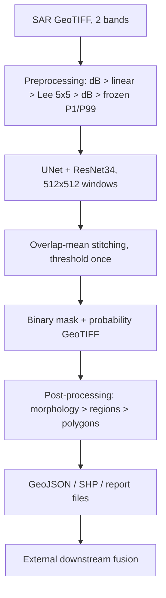

# SAR Oil-Spill Segmentation — U-Net / ResNet34

Semantic segmentation of possible oil-spill regions in Sentinel-1 SAR imagery.
The model identifies pixels predicted to belong to oil-spill regions (`1 = predicted oil`, `0 = background`). It does **not** prove a spill: SAR dark regions can also be look-alikes (low-wind areas, biogenic slicks, wakes). Outputs are candidate polygons + files for downstream fusion; there is no database, API, or Docker integration in this repository.

## Quick Start (Windows, copy-paste)

```powershell
python -m venv .venv; .\.venv\Scripts\Activate.ps1
pip install -r requirements.txt   # Python 3.14; torch 2.14.0+cu126 (CUDA 12.6)
# Inference (defaults: stride 384, threshold 0.5)
.venv\Scripts\python.exe -m inference.predict_scene --scene <sar.tif> --checkpoint checkpoints\best_model.pth --output-dir <out-dir>
# Post-processing (defaults: threshold 0.5, open 3, close 3, min area 100 px)
.venv\Scripts\python.exe -m postprocessing.run_postprocess --prob <out-dir>\<stem>_prob.tif --output-dir <pp-dir>
```

## System Architecture



| Stage | Code | Output |
|---|---|---|
| Preprocessing | `preprocessing/pipeline.py` (`process_scene`) | normalized tensor |
| Inference | `inference/predict_scene.py` | `{stem}_prob.tif`, `{stem}_mask.tif`, `{stem}_inference.json` |
| Post-processing | `postprocessing/run_postprocess.py` | masks, GeoJSON, SHP set, report JSON |
| Training | `training/train.py` | `checkpoints/best_model.pth` |
| Evaluation | `evaluation/evaluate_model.py`, `tools/val_analysis.py` | CSV/JSON reports |

## Model Architecture (`models/unet_resnet34.py`)

Custom U-Net with a ResNet34-style encoder (no LinkNet variant exists here):

- **Encoder**: stem 7×7 conv rebuilt for **2 input channels** → residual stages → 512-ch bottleneck. Skip connections tap each stage.
- **Decoder**: 4 upsampling blocks, widths **[256, 128, 64, 32]**, each fusing the matching skip; **1×1 conv head → 1 logit channel**; sigmoid applied exactly once at inference.
- **Init**: random (Kaiming), `pretrained=False` for this experiment — no ImageNet weights. A `pretrained=True` path exists but **requires a local weights file** (`weights_path`); none is bundled. ~24.43M parameters.

U-Net suits this task because skips preserve fine spill boundaries while the deep path adds context to reject look-alikes.

## Input

- Tensor `[2, 512, 512]`, float32, two SAR bands in file order. Stored values are Sigma0 backscatter in dB; polarization set is {VV, VH} but **per-band order is unresolved** (band 2 is systematically stronger, opposite the canonical VV > VH ordering — order stays UNKNOWN).
- Normalization: frozen train-only P1/P99 — band 0 `[−41.2278, 0.0]`, band 1 `[−34.3992, 0.0]` (`processed_dataset/metadata/preprocessing_config.json`). Test/val reuse these bounds; refitting raises.
- Masks: uint8 `{0, 1}`, `0 = background`, `1 = oil`.

## Dataset (Trujillo-Acatitla et al., Zenodo `8346860` / `8253899` / `13761290`, CC BY 4.0)

| Split | Scenes (Oil/Lookalike/No-oil) | Source |
|---|---|---|
| train | 2053 (958/547/548) | `processed_dataset/{train}/images\|masks/` |
| val | 513 (239/137/137) | same layout |
| test | 450 (150×3), 2048×2048, EPSG:4326 | `processed_dataset/test/` |

Tiles for training are 512×512 (`processed_dataset/metadata/tile_index.csv`: 32,860 train / 8,208 val / 7,200 test rows). Known issues: `Oil/00007 == Oil/01339` with conflicting masks (both quarantined); exact duplicates excluded; ~2.6% exact-zero pixels treated as ordinary pixels pending author confirmation.

## Preprocessing (exact order, train ≡ inference)

dB input → dB→linear → Lee 5×5 (linear domain) → linear→dB → frozen P1/P99 → tensor. No resizing; scenes smaller than a tile get reflect padding. Augmentation is **disabled** for this experiment. GT masks are never augmented at inference/evaluation.

## Training

```powershell
.venv\Scripts\python.exe -m training.train --epochs 50 --batch-size 2 --learning-rate 1e-4 --optimizer Adam --scheduler none --mixed-precision --data-source cache --early-stop-patience 8 --checkpoint-dir checkpoints
```

Defaults: 50 epochs, batch 2, Adam lr 1e-4, scheduler none, early-stop patience 8 on val loss, AMP on, seed 42, sampler `scene_major` (no class weighting; 82.5% of train tiles are empty-mask). Loss **0.5·BCEWithLogits + 0.5·soft-Dice** (smooth 1.0): BCE sees every pixel, Dice restores foreground signal at ~1–3% oil coverage; empty tiles get no special case. Ran 24 epochs (8.65 h, RTX 3050 6 GB); best epoch 20, tile-level **val_dice 0.55826** → `checkpoints/best_model.pth` (293 MB, sha256 `840a9018…`).

## Inference

```powershell
.venv\Scripts\python.exe -m inference.predict_scene --scene <sar.tif> --checkpoint checkpoints\best_model.pth --output-dir <dir> [--stride 384] [--threshold 0.5] [--batch-size 4] [--device cuda|cpu]
```

Sliding 512-windows (stride 384 = overlap 128; edge snap, full coverage asserted) → batched forward → sigmoid once → overlap-mean stitch → threshold **after** reconstruction (never per-tile). Test-split scenes are refused without `--allow-test`. Mean ~4.9 s/scene (2048², RTX 3050). Batch: one scene per call; `run_logs/full_run_batch.ps1` loops the 450 test scenes.

## ONNX Export

### Why ONNX?

ONNX provides a framework-independent representation of the trained neural network and can make deployment easier across environments (no PyTorch/training code needed at inference time).

### Export

```powershell
.venv\Scripts\python.exe export_onnx.py --checkpoint checkpoints\best_model.pth --output checkpoints\best_model.onnx
```

Optional flags: `--opset 17` (default), `--device cpu`, `--real-image <sar.tif>` (validation tile source; default `processed_dataset/test/images/Oil/00000.tif`). The script reconstructs the exact `UNetResNet34(in_channels=2, out_channels=1, pretrained=False)` architecture, loads `checkpoint["model_state_dict"]` with `strict=True` (fails loudly on any key mismatch), exports with `torch.onnx.export(..., dynamo=False)` — the TorchScript path, chosen deliberately for stable `input`/`segmentation` names and broad ONNX Runtime compatibility — then validates (`onnx.checker`), runs ONNX Runtime, and compares PyTorch vs ONNX on dummy input plus real SAR tiles.

NOTE: the model is a fully custom U-Net (`models/unet_resnet34.py`, torchvision ResNet34 encoder); `segmentation_models_pytorch` is listed in requirements but is NOT used by this architecture.

### Input

- shape: `[1, 2, 512, 512]` (NCHW, fixed — no dynamic axes; inference tiles are always 512×512)
- dtype: float32, two SAR bands normalized to [0,1] via frozen P1/P99 bounds (band 0 `[−41.2278, 0.0]`, band 1 `[−34.3992, 0.0]`); preprocessing stays OUTSIDE the ONNX graph
- names: input `input`

### Output

- shape: `[1, 1, 512, 512]` float32, name `segmentation`
- meaning: RAW LOGITS (no sigmoid inside ONNX). Apply sigmoid exactly once, then threshold at 0.5 AFTER stitching — identical to `inference/predict_scene.py`. The existing post-processing chain (threshold → open 3 / close 3 → components ≥100 px → GeoJSON/SHP) consumes ONNX output unchanged; CRS/transform/polygons stay outside ONNX.

### Validation (measured 2026-09-22, opset 17, IR 8)

| Check | Result |
|---|---|
| `onnx.checker` | valid |
| Dummy logits max / mean abs diff | 1.48e-05 / 2.15e-06 |
| Real SAR tile (Oil/00000, y=1024,x=0, 7021 pos px) logits max / mean abs diff | 1.95e-04 / 3.93e-06 |
| Mask agreement / IoU / Dice @0.5 (dummy, background tile, positive tile) | 1.0 / 1.0 / 1.0 |
| Sizes | `best_model.pth` 293.4 MB → `best_model.onnx` 97.7 MB (FP32, no quantization) |

### Runtime

- ONNX Runtime CPU (`CPUExecutionProvider`): verified working.
- ONNX Runtime GPU (`CUDAExecutionProvider`): NOT verified — the installed `onnxruntime` 1.30 CPU build only exposes `AzureExecutionProvider`/`CPUExecutionProvider`. Use PyTorch CUDA inference for GPU until a GPU ORT build is validated.
- Single-tile test: `python test_onnx.py --compare-torch [--save-mask out.tif]`

`checkpoints/` (including `*.onnx`) is git-ignored: do not commit the 98 MB model — regenerate it with the export command above.

## Post-processing (`postprocessing/config.py` is the single source of truth)

```powershell
.venv\Scripts\python.exe -m postprocessing.run_postprocess --prob <stem>_prob.tif --output-dir <dir> [--threshold 0.5] [--opening-kernel 3] [--closing-kernel 3] [--min-region-area 100]
```

prob → threshold → binary → opening → closing (pure-NumPy) → connected components (≥100 px) → polygons → area → files. **Model output vs cleaned output are distinct files** (`_binary_mask.tif` vs `_cleaned_mask.tif`); visualization/eval use the thresholded prediction only.

| Output | Schema / notes |
|---|---|
| `{stem}_binary_mask.tif`, `{stem}_cleaned_mask.tif` | uint8 {0,1}, source CRS + transform |
| `{stem}_predictions.geojson` | FeatureCollection, Polygon, `crs.name = EPSG:4326`; properties: `scene_id, candidate_id, threshold, pixel_area, geographic_area_km2, centroid_geo_lon/lat, centroid_pixel_row/col` |
| `{stem}_predictions.shp/.shx/.dbf/.prj` | polygon shapefile set, same features |
| `{stem}_postprocessing_report.json` | counts, `total_predicted_area_km2`, timings, paths; **empty prediction → `0.0`** (never null; regression test `tools/test_postprocessing_report.py`) |

## Georeferencing

CRS + affine transform are copied from the source raster (test scenes: EPSG:4326); polygon coordinates derive from that transform and are asserted inside source bounds. A plain PNG carries no coordinates — geographic output requires a georeferenced GeoTIFF input.

## Tiling and stitching

Train tiles (512, from `tile_index.csv`) ≠ inference windows (dynamic 512/384, never materialized). Overlap is combined by uniform mean; `finalize()` raises on uncovered pixels.

## Results (all MEASURED; threshold 0.5 unless noted)

| Metric | Test global (450 scenes) | Test scene-mean | Val pooled |
|---|---|---|---|
| IoU | 0.15028 | 0.254 | — |
| Dice | 0.26129 | 0.316 | **0.61114** @ stride 512, thr 0.80 |
| Precision | 0.77611 | 0.615 | — |
| Recall | 0.15709 | 0.379 | — |
| F1 | 0.26129 | 0.552 | — |

IoU = TP/(TP+FP+FN); Dice = overlap of pred/GT; precision = false-positive behavior; recall = missed oil; F1 = their balance — read them together. Groups (@0.5): Oil mean IoU 0.337 (FP scenes 112/150); No-oil FP rate 0.02; Lookalike FP rate 0.307. Test is harder than val (35/150 Oil scenes score zero) — a measurement, not a bug. Full tables: `evaluation/test_results.csv`, `evaluation/test_summary.json`.

## GLCM / Database / API

**Not implemented.** No texture features, no PostgreSQL/PostGIS/SQLite writes, no FastAPI service, no Docker. Outputs are files; downstream fusion is external. Do not document them as features.

## Environment setup

```powershell
python -m venv .venv; .\.venv\Scripts\Activate.ps1
pip install -r requirements.txt   # numpy 2.5.3, rasterio 1.5.1, torch 2.14.0+cu126, smp 0.5.0, ...
.venv\Scripts\python.exe -c "import torch; print(torch.cuda.is_available(), torch.cuda.get_device_name(0))"
```

CPU fallback is automatic (`cuda` if available else `cpu`).

## Troubleshooting

- **CUDA unavailable**: check `torch.cuda.is_available()`; CPU still works, slower.
- **Checkpoint not found**: expected at `checkpoints/best_model.pth` (regenerate via training).
- **Shape mismatch**: model needs `[2,512,512]` float32; masks must be single-band uint8 {0,1}.
- **No CRS**: polygon coordinates fall back to pixel space; verify source GeoTIFF metadata.
- **Empty polygons**: threshold too high, empty prediction, or morphology/area filter removed everything (defaults open 3 / close 3 / 100 px).
- **Test refusal**: inference blocks test scenes without `--allow-test` (evaluation-only flag, never for tuning).

## Limitations (evidence-backed)

- Look-alike confusion is the dominant error (measured FP rates above); confidence ≠ confirmation.
- Small spills score ~0.10 Dice below medium/large (val); model is over-confident (pred−obs +0.31).
- Generalization is distribution-bound (test ≪ val at 0.5); polarization order and zero-fill semantics unresolved (see Dataset).
- Segmentation alone gives no source, volume, or drift — and no vessel attribution.

## Scope

DOES: pixel-level candidate detection, masks, cleaned regions, polygons, areas, file outputs. DOES NOT: prove petroleum, identify vessels, assign liability, replace human review, or forecast movement.

## Repository structure

```text
inference/predict_scene.py  full-scene inference CLI
postprocessing/             config, morphology, vectorize, report, run_postprocess, validate
preprocessing/              pipeline, tiling, augmentation, tile_dataset
training/                   train, dataloader (scene_major), losses (BCEDiceLoss), metrics
models/unet_resnet34.py     the only architecture (no LinkNet)
evaluation/                 canonical final-test evaluator + test_results.csv/test_summary.json
tools/                      val_analysis, val_diagnosis, smoke/verify/test scripts
checkpoints/                best_model.pth, last_model.pth (git-ignored, regenerable)
processed_dataset/          splits, tile_index.csv, preprocessing_config.json, tile_cache/
dataset/                    immutable source (136 GB, git-ignored)
```

## Reproducibility

Python 3.14.7 · torch 2.14.0+cu126 · seed 42 · frozen bounds above · checkpoint sha `840a9018…028e58c5057be752ac44ecb60883e8029243fa`. Val analysis: `tools/val_analysis.py` (~35 min). Canonical test eval: `evaluation/evaluate_model.py` (~15 min, protocol-fixed threshold 0.5).

## Citation

Trujillo-Acatitla et al. (2024), *Mar. Pollut. Bull.* 204, 116549 (`10.1016/j.marpolbul.2024.116549`); data Zenodo `10.5281/zenodo.8346860`, `10.5281/zenodo.8253899`, `10.5281/zenodo.13761290` (CC BY 4.0). No license file is present in this repository.
